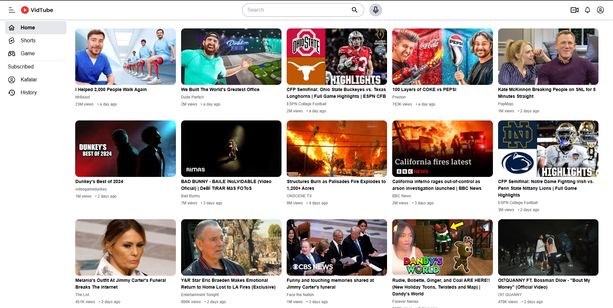
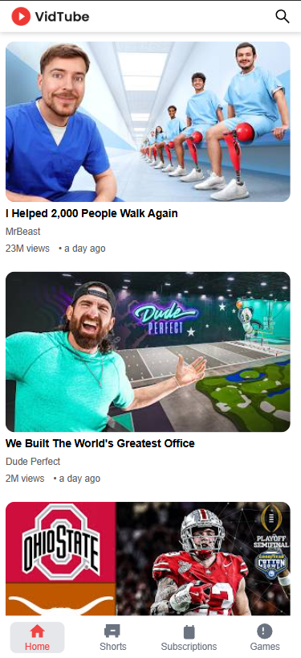
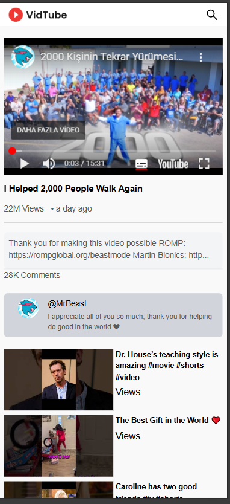
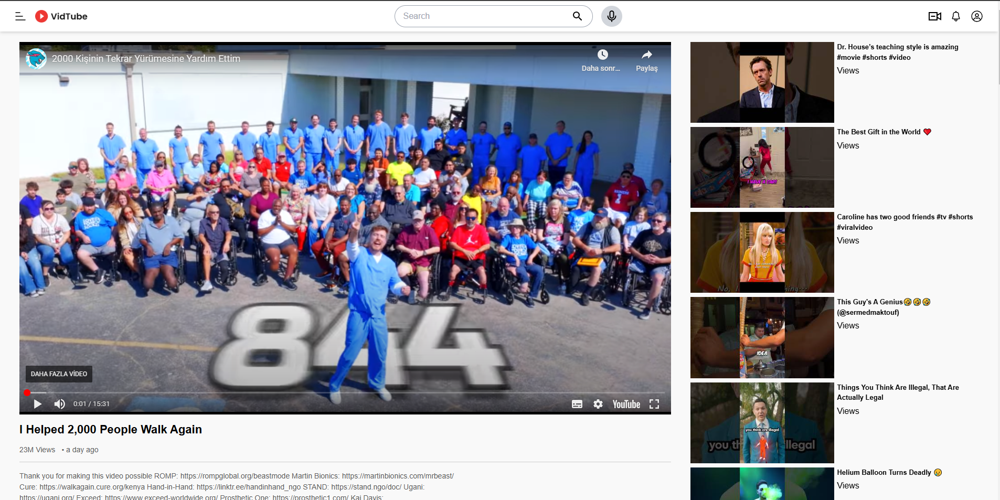
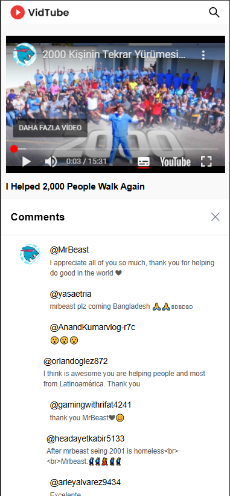

# YouTube Clone

A professional YouTube-like application built with React and powered by the YouTube Data API.

## Features
- **Video Search:** Users can search for videos using the YouTube Data API.
- **Video Playback:** Watch videos directly within the application.
- **Channel Information:** Display details about video creators.
- **Responsive Design:** Fully optimized for both desktop and mobile devices.
- **Real-time Data:** Fetch live data from YouTube to ensure up-to-date content.

## Tech Stack
- **Frontend:** React, React Router, Axios
- **API:** YouTube Data API v3
- **Styling:** CSS / TailwindCSS / Material-UI (choose the one you used)
- **State Management:** (e.g., React Context, Redux, or others if used)

## Screenshots






## Installation
Follow these steps to run the project locally:

### Prerequisites
- Node.js (version 20.11.1 or later)
- npm or yarn installed

### Steps
1. Clone the repository:
   ```bash
   git clone https://github.com/your-username/your-repo-name.git
   cd your-repo-name
   ```
2. Install dependencies:
   ```bash
   npm install
   # or
   yarn install
   ```
3. Set up the environment variables:
   - Create a `.env` file in the root of the project.
   - Add your YouTube Data API key:
     ```env
     REACT_APP_YOUTUBE_API_KEY=your_api_key_here
     ```
4. Start the development server:
   ```bash
   npm start
   # or
   yarn start
   ```
5. Open the application in your browser at [http://localhost:3000](http://localhost:3000).

## Deployment
To deploy the project, use one of the following platforms:

### Vercel
1. Push your project to GitHub.
2. Connect your GitHub repository to [Vercel](https://vercel.com/).
3. Add the environment variable `REACT_APP_YOUTUBE_API_KEY` in the Vercel dashboard.
4. Deploy and share your live application link.

### Netlify
1. Push your project to GitHub.
2. Connect your GitHub repository to [Netlify](https://www.netlify.com/).
3. Add the environment variable `REACT_APP_YOUTUBE_API_KEY` in the Netlify dashboard.
4. Deploy and share your live application link.

**Live Demo:** [YouTube Clone Live](https://your-netlify-link.netlify.app)

## Folder Structure
```
.
├── dist
├── node_modules
├── public
│   ├── index.html
├── src
│   ├── assets
│   ├── Components
│   │   ├── BottomNavbar
│   │   │   └── BottomNavbar.jsx
│   │   ├── Comments
│   │   │   └── Comments.jsx
│   │   ├── Feed
│   │   │   └── Feed.jsx
│   │   ├── Navbar
│   │   │   ├── Navbar.jsx
│   │   │   └── Navbar.css
│   │   ├── PlayVideo
│   │   │   └── PlayVideo.jsx
│   │   ├── Recommended
│   │   │   └── Recommended.jsx
│   │   └── SideBar
│   │       ├── SideBar.jsx
│   │       └── SideBar.css
│   ├── Pages
│   │   └── App.jsx
│   ├── data.js
│   ├── index.css
│   ├── main.jsx
├── .gitignore
├── eslint.config.js
├── index.html
├── package.json
├── package-lock.json
├── postcss.config.js
├── tailwind.config.js
├── vite.config.js
└── README.md
```

## API Usage
- **YouTube Data API v3:**
  - Refer to the official [API Documentation](https://developers.google.com/youtube/v3/docs).

## Contributing
Contributions are welcome! Follow these steps to contribute:
1. Fork the repository.
2. Create a new branch:
   ```bash
   git checkout -b feature-name
   ```
3. Make your changes and commit them:
   ```bash
   git commit -m "Add some feature"
   ```
4. Push to the branch:
   ```bash
   git push origin feature-name
   ```
5. Create a pull request.

## License
This project is licensed under the MIT License. See the [LICENSE](./LICENSE) file for details.

## Acknowledgements
- [YouTube Data API](https://developers.google.com/youtube/v3)
- [React Documentation](https://reactjs.org/docs/getting-started.html)


---

**Made with ❤️ by [Berat Kartaş](https://github.com/bkaratas)**

